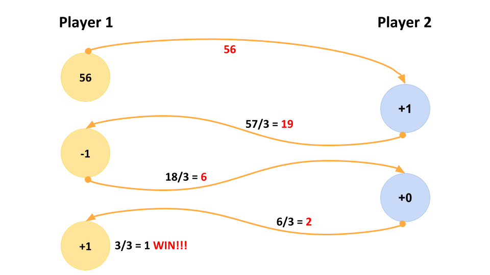
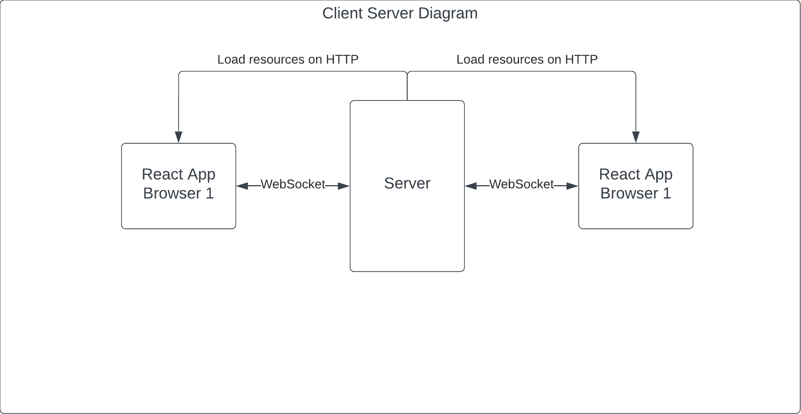
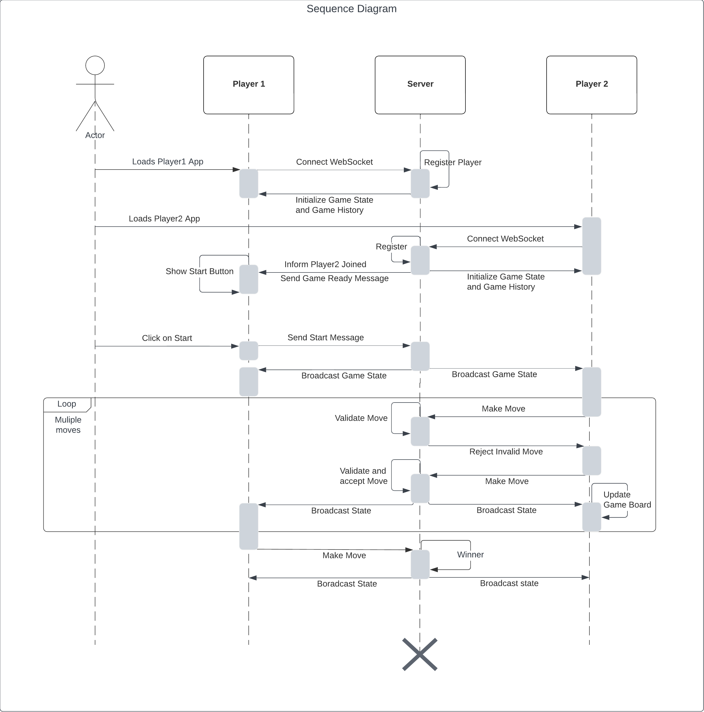

# Game of Three

## Overview

The Game of Three is a two-player number game built on Node.js, Express, WebSocket, and React. This application allows players to communicate through WebSocket.

## Game Rule

When a player starts, it incepts a random (whole) number and sends it to the second player as an approach to starting the game. The receiving player can now always choose between adding one of {-1, 0, 1} to get to a number that is divisible by 3. Divide it by three. The resulting whole number is then sent back to the original sender.



## Requrements

You will need:

- `yarn`
- `node 20.10.0`

Recommended: Install node version using `nvm`.

## Install dependencies:

```
yarn setup
```

## Build and Start

To build the client and server:

```
yarn build
```

To run the server:

```
yarn start-server
```

## Development

For server:

```
yarn dev
```

For client:

```
cd client
yarn start
```

Server configurations can be adjusted with a `.env` in the root directory for local purposes.

## Diagrams




